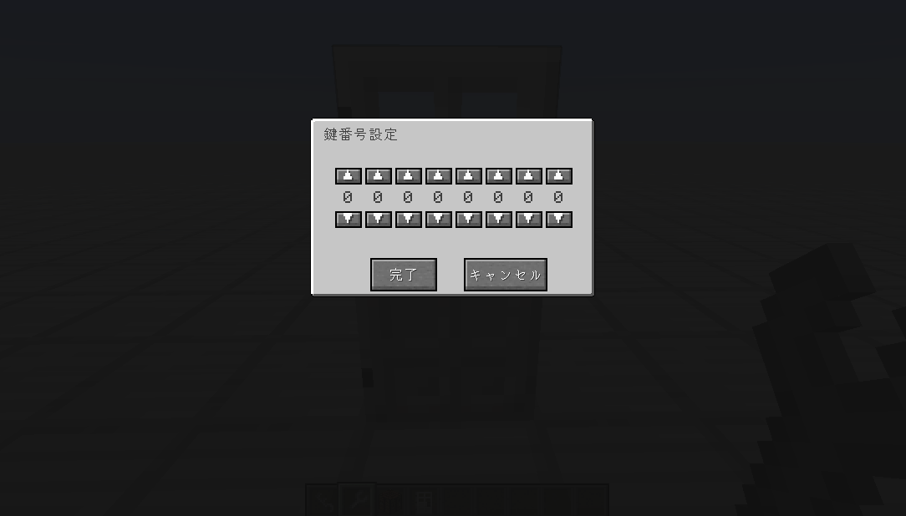
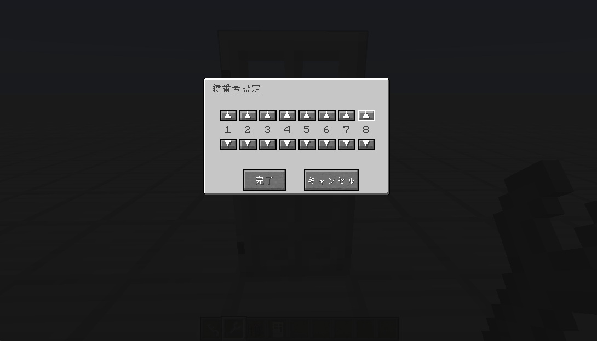
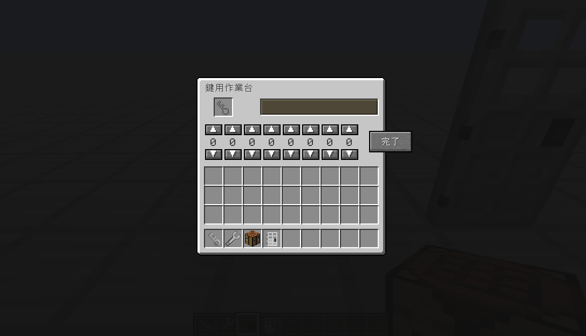
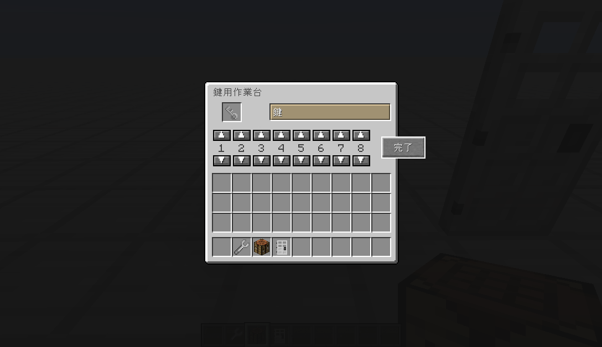
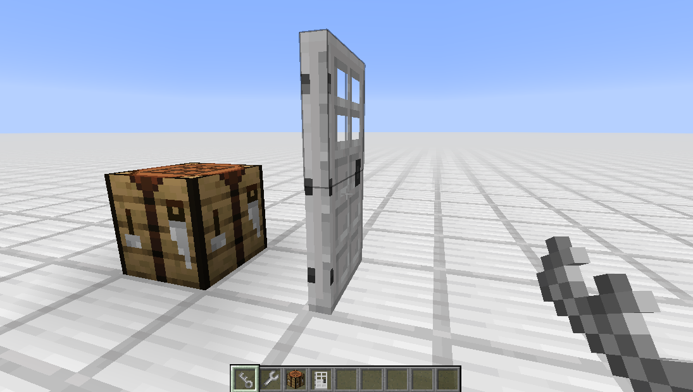

追加アイテム
=======

以下のアイテム・ブロックが追加されます。

* 鍵
* 鍵用工具
* 鍵用作業台
* 鍵付きドア

使い方
=======

鍵付きドアを設置します。 
鍵用工具を持った状態で右クリックすると、GUIが開きます。
 

任意の番号を設定し、「決定」を押します。
 

対応する鍵の設定方法です。 
鍵用作業台を置き、右クリックするとGUIが開きます。 
（鍵用作業台はバニラの作業台と同じ見た目ですが、別物です）
 

鍵をセットし、任意の番号を設定します。
 

鍵と鍵付きドアに設定された番号が一致する場合、ドアが開きます。
 

閉じるときは鍵は必要ありません。
